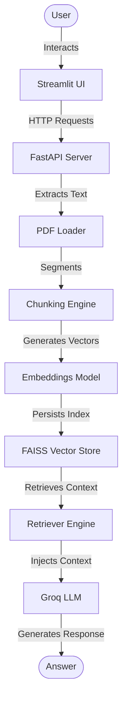

# Chat With Your Docs

An AI-powered Retrieval-Augmented Generation (RAG) application that allows users to upload a PDF document and instantly ask context-aware questions. The application combines a high-performance FastAPI backend with an intuitive, interactive Streamlit chat interface, leveraging LangChain, FAISS, and Groq Llama 3 to deliver fast and accurate answers.

---

## Project Overview

**Chat With Your Docs** provides an end-to-end RAG pipeline designed to run locally. When a PDF is uploaded, the backend processes and parses the file, splits it into manageable text chunks, generates vector embeddings, and stores them in a local FAISS database index. 

When a user submits a question through the Streamlit frontend, the backend retrieves the most relevant context chunks from the FAISS index and constructs a target prompt. The prompt is then processed by a Groq-hosted Llama-3.3-70b-versatile model to produce a contextually grounded, accurate answer.

---

## Features

- **Streamlined PDF Upload**: Upload PDF documents via a sidebar component built on the Streamlit frontend.
- **Local Vector Storage**: Uses FAISS (Facebook AI Similarity Search) to index, persist, and retrieve document chunks.
- **Semantic Text Embeddings**: Uses HuggingFace Sentence Transformers (`all-MiniLM-L6-v2`) to produce semantic embeddings.
- **FastAPI REST API**: High-performance backend exposing cleanly defined `/upload` and `/ask` endpoints.
- **ChatGPT-Style Frontend**: A modern Streamlit chat user interface featuring message history, auto-scroll, loaders, and input guards to prevent querying before document upload.
- **LLM Question Answering**: Leverages Groq's high-speed endpoint hosting Llama-3.3-70b-versatile for generating answers.

---

## Architecture

The workflow below illustrates how the frontend, backend, document loader, vector store, and LLM communicate:



---

## Folder Structure

```
.
├── app/                     # FastAPI backend application
│   ├── __init__.py
│   ├── chain.py             # LangChain RAG pipeline setup
│   ├── config.py            # Configuration and environment loading
│   ├── embeddings.py        # HuggingFace embedding model initialization
│   ├── llm.py               # ChatGroq LLM client setup
│   ├── loader.py            # PDF document loader (PyPDF)
│   ├── main.py              # FastAPI server entry point and endpoint routes
│   ├── rag.py               # Chunking utilities
│   ├── retriever.py         # FAISS vector store retriever utilities
│   └── vectorstore.py       # FAISS vector store creation/saving/loading
├── frontend/                # Streamlit user interface
│   └── app.py               # Streamlit application script
├── uploads/                 # Local directory for uploaded PDFs
├── vectorstore/             # Local database directory for persisted FAISS index
├── .env                     # Configuration file for API keys and endpoint URLs
├── .gitignore               # Ignored files for version control
├── README.md                # Project documentation
└── requirements.txt         # Project python dependencies
```

---

## Installation

### Prerequisites
- Python 3.10 or higher
- Git

### Steps

1. Clone the repository:
   ```bash
   git clone https://github.com/placeholder-username/Chat-With-Your-Docs.git
   cd Chat-With-Your-Docs
   ```

2. Create a virtual environment and activate it:
   ```bash
   # Windows (PowerShell)
   python -m venv venv
   .\venv\Scripts\Activate.ps1

   # Linux/macOS
   python -m venv venv
   source venv/bin/activate
   ```

3. Install the required dependencies:
   ```bash
   pip install -r requirements.txt
   ```

---

## Environment Variables

Create a `.env` file in the root directory and configure the following variables:

| Variable | Description | Example / Default |
| --- | --- | --- |
| `GROQ_API_KEY` | API Key for accessing Groq Llama models | 
| `BACKEND_URL` | Base URL of the running FastAPI server | 


## Running the Application

### 1. Start the FastAPI Backend
From the root directory, start the FastAPI server using Uvicorn:
```bash
uvicorn app.main:app --reload
```
The backend server will run at `http://127.0.0.1:8000`.

### 2. Start the Streamlit Frontend
In a new terminal window (with the virtual environment activated), start the Streamlit app:
```bash
streamlit run frontend/app.py
```
The frontend interface will open automatically in your browser at `http://localhost:8501`.

---

## API Endpoints

The backend exposes the following REST API endpoints:

### 1. Upload PDF
- **Endpoint**: `POST /upload`
- **Description**: Uploads a PDF document, splits it into semantic chunks, creates text embeddings, saves the FAISS index, and executes a candidate validation query.
- **Request Format**: Multipart Form Data
  - `file`: `UploadFile` (Required)
- **Response Format**: `JSON`
  - Example:
    ```json
    {
        "message": "File uploaded successfully!",
        "filename": "sample_resume.pdf"
    }
    ```

### 2. Ask Question
- **Endpoint**: `POST /ask`
- **Description**: Submits a query to search the FAISS vector database and generate an answer from the LLM.
- **Request Format**: `JSON`
  - Example:
    ```json
    {
        "question": "What is the candidate's experience with Python?"
    }
    ```
- **Response Format**: `JSON`
  - Example:
    ```json
    {
        "question": "What is the candidate's experience with Python?",
        "answer": "Based on the provided document, the candidate has 3+ years of experience writing Python code for backend microservices and data engineering pipelines."
    }
    ```

---

## Screenshots

The project user interface contains the following layouts:

### Main Interface (Initial State)
*Informational alerts display instructions and disable input before document processing.*


### Document Upload (Sidebar)
*User-friendly upload validation alerts and loading indicators are provided during chunking.*


### Chat Workspace (Active Conversation)
*Full-featured conversation layout showing queries, responses, and clear chat triggers.*


---

## Future Improvements

Planned future features to expand the application capability:
- **Multiple PDF Support**: Ability to upload and build index across multiple documents simultaneously.
- **Chat Memory**: Support context tracking across consecutive questions in a conversation thread.
- **Citation Highlighting**: Provide source page and text snippet indicators for generated answers.
- **Authentication**: Add user accounts and secure workspace management.
- **Cloud Vector Database**: Migrate from local file-based FAISS to Pinecone or Milvus for horizontal scaling.
- **Docker Support**: Containerize frontend and backend services for simple cloud deployments.

---

## License

This project is licensed under the MIT License. See the [LICENSE](LICENSE) file for details.

---

## Author

- **Name** - [Your Name](mailto:your.email@example.com)
- **GitHub** - [@yourgithub](https://github.com/yourgithub)
- **LinkedIn** - [your-profile](https://www.linkedin.com/in/your-profile)
- **Email** - [your.email@example.com](mailto:your.email@example.com)
